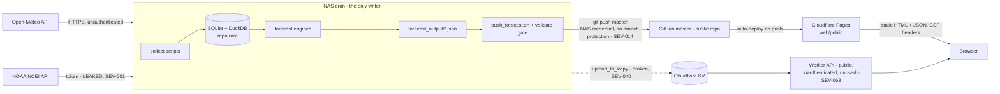

# Security & Code Audit — Wisconsin Snowfall Forecast System

**Date:** 2026-08-22
**Auditor:** Claude (Fable 5), full read-only audit with local runtime verification
**Repository:** `salvadordali256/weather` (public), branch `task/reorg-v2` at `86ed90e`
**Scope:** entire repository, git history, live site (`weather.salvadordali256.net`), live Worker API, dependency scan, local test run

---

## 1. Executive summary

This system does what it says on the tin — a NAS cron pipeline collects weather data, generates a snowfall forecast, and publishes a static site through a git push to Cloudflare Pages — and parts of it are genuinely well engineered: the publish gate that refuses to deploy a broken site, the empty-forecast guard, consistent HTTP timeouts on every single API call, and a set of security headers most hobby projects never ship. The architecture (static site, no server, no user data) also keeps the attack surface inherently small.

That said, the audit found **one urgent security problem and a cluster of correctness problems serious enough that the published forecast numbers should not be trusted until they are fixed.**

The urgent item: a **real, working NOAA API token, together with the owner's email address, is committed in three tracked files of a public GitHub repository** and has been there since the initial commit. Anyone on the internet can use it. It must be rotated at NOAA first, then removed from the files and from git history. Relatedly, the belief that `master` is branch-protected is incorrect — the GitHub API confirms no protection exists — and the NAS holds a credential that can push directly to production.

The correctness cluster is the bigger long-term story. The forecast pipeline contains several independent bugs that each silently distort or zero-out the published numbers: the library's own fetcher writes centimeters into a column every consumer reads as millimeters (a 10× error); the same fetcher writes station IDs that the forecast engines cannot read at all; six of the eleven "regional predictors" — 79% of the regional weight — have no data-ingestion path; the ensemble math lets a single active station drive the forecast to 85%; some derived probabilities can exceed 100%; and the teleconnection analysis reports its lag direction backwards, so "Siberia leads Wisconsin by 7 days" is exported as the reverse. None of these throw errors. They all produce confident-looking output.

The third theme is **silent operational failure — and it is not hypothetical, it is happening right now.** The live site is serving a forecast generated on **June 23, 2026 — two months ago** — while the homepage tells visitors "Data updates daily at 6:00 AM and 5:30 PM CST." Nothing detected this. The audit found the exact mechanism that makes this inevitable: the push script permanently wedges after a single rejected git push and then reports success forever; the orchestrator script ignores 6 of its 10 step failure statuses; there is no lock preventing overlapping runs, no alerting of any kind, and no staleness indicator on the site.

**What to do first:** (1) rotate the NOAA token today and purge it from the repo; (2) SSH into the NAS and un-wedge the pipeline (there is almost certainly a stack of unpushed local commits), then apply the small `push_forecast.sh` and `daily_update.sh` fixes so it cannot recur silently; (3) add a dead-man alert (a free healthchecks.io ping is enough) and a staleness banner on the site; (4) fix the four Critical logic bugs before trusting any forecast this coming winter. Everything else can be scheduled.

---

## 2. Findings summary table

| ID | Title | Severity | Confidence | Category | File |
|---|---|---|---|---|---|
| SEV-001 | Live NOAA API token + owner email committed to public repo | Critical | Confirmed | Security | `scripts/setup_guide.py:143` |
| SEV-002 | Library fetcher stores Open-Meteo cm/m/km-h raw into mm-named columns | Critical | Confirmed | Logic | `src/snowforecast/fetchers/global_snowfall_fetcher.py:312` |
| SEV-003 | Fetcher and engines use incompatible station-ID schemes | Critical | Confirmed | Logic | `src/snowforecast/fetchers/global_snowfall_fetcher.py:247` |
| SEV-004 | Regional score normalizes over active stations only — one station saturates the forecast | Critical | Confirmed | Logic | `src/snowforecast/engines/enhanced_regional_forecast_system.py:208` |
| SEV-005 | Teleconnection lag direction inverted in reports and exported model | Critical | Confirmed | Logic | `src/snowforecast/analysis/global_correlation_analysis.py:237` |
| SEV-006 | Composite event probability can exceed 100% | Critical | Confirmed | Logic | `src/snowforecast/analysis/local_event_analyzer.py:163` |
| SEV-007 | Live site serving 60-day-old forecast as current; no freshness contract | High | Confirmed | Backend | `web/public/latest_forecast.json` |
| SEV-008 | `push_forecast.sh` wedges permanently after one rejected push, then reports success | High | Confirmed | Backend | `scripts/shell/push_forecast.sh:45` |
| SEV-009 | `daily_update.sh` ignores 6 of 10 step failure statuses | High | Confirmed | Backend | `scripts/shell/daily_update.sh:125` |
| SEV-010 | No `set -euo pipefail` in production scripts; `tee` exit-code bug | High | Confirmed | Backend | `scripts/shell/run_daily_forecast.sh:25` |
| SEV-011 | No overlap protection between cron chains | High | Confirmed | Backend | `scripts/shell/daily_update.sh` |
| SEV-012 | Forecast JSON published via non-atomic truncating writes (4 sites) | High | Confirmed | Backend | `scripts/pipeline/daily_automated_forecast.py:253` |
| SEV-013 | `INSERT OR REPLACE` in 11 collectors defeats data-authority guard, NULLs ~18 columns | High | Confirmed | Logic | `scripts/collect/add_lake_superior_stations.py:93` |
| SEV-014 | Public repo + no branch protection + NAS push credential = unguarded production deploy | High | Confirmed | Security | GitHub settings |
| SEV-015 | Six regional predictors (79% of regional weight) have no ingestion path | High | Confirmed | Logic | `src/snowforecast/engines/enhanced_regional_forecast_system.py:47` |
| SEV-016 | Two writers use different day boundaries (UTC vs America/Chicago) in one table | High | Confirmed | Logic | `src/snowforecast/fetchers/global_snowfall_fetcher.py:288` |
| SEV-017 | Naive local `datetime.now()` as "today" and for season gates | High | Confirmed | Logic | `src/snowforecast/engines/pattern_matching_forecast.py:48` |
| SEV-018 | Forecast windows query future dates; regional block guaranteed zero for days 4–7 | High | Confirmed | Logic | `scripts/pipeline/daily_automated_forecast.py:77` |
| SEV-019 | NOAA fetched in metric, then divided by 10 again in DuckDB layer (temps 10× off) | High | Confirmed | Logic | `src/snowforecast/storage/duckdb_queries.py:72` |
| SEV-020 | Fetcher swallows failures: lost chunks marked complete; parquet year files overwritten | High | Confirmed | Logic | `src/snowforecast/fetchers/openmeteo_weather_fetcher.py:165` |
| SEV-021 | `esc()` helper not attribute-safe; ~12 attribute-context sinks believe they are escaped | High | Confirmed | Security | `web/public/planner.js:7` |
| SEV-022 | `report.js` error path destroys its own render targets; page bricked until reload | High | Confirmed | Frontend | `web/public/report.js:195` |
| SEV-023 | Unguarded `localStorage` `JSON.parse` white-screens the planner permanently | High | Confirmed | Frontend | `web/public/planner.js:23` |
| SEV-024 | `toISOString()` date arithmetic shifts dates/scores for viewers east of UTC | High | Confirmed | Frontend | `web/public/planner.js:217` |
| SEV-025 | Broken/hardcoded script paths: macOS dev paths and pre-reorg locations in 6 scripts | High | Confirmed | Backend | `scripts/shell/early_morning_collection.sh:6` |
| SEV-026 | `sqlite3.connect` without timeout on cron paths; lock contention misread as corruption | High | Confirmed | Backend | `scripts/shell/sync_to_nas.sh:37` |
| SEV-027 | No monitoring, alerting, or dead-man switch anywhere | High | Confirmed | Backend | (systemic) |
| SEV-028 | 2.38 MB JSON fetched behind a blocking overlay before first render | High | Confirmed | Frontend | `web/public/planner.js:321` |
| SEV-029 | Predictor with no data scores ACTIVE (`0.0 >= 0.0`); percentile of a 2-element list | High | Confirmed | Logic | `src/snowforecast/engines/major_event_predictor.py:251` |
| SEV-030 | Three engines convert missing data into "0.0 mm = confirmed no snow"; falsy-zero filters | Medium | Confirmed | Logic | `src/snowforecast/engines/integrated_forecast_system.py:86` |
| SEV-031 | `data_quality: 'no_data'` computed but ignored inside the engine | Medium | Confirmed | Logic | `src/snowforecast/engines/enhanced_regional_forecast_system.py:258` |
| SEV-032 | Duplicated, diverged forecast logic across 5 engines (thresholds, lags, weights) | Medium | Confirmed | Logic | `src/snowforecast/engines/` |
| SEV-033 | Weight renormalization inverts documented model priority; stronger signals get less trust | Medium | Confirmed | Logic | `src/snowforecast/engines/integrated_forecast_system.py:217` |
| SEV-034 | Lag chosen from 61 tests with no multiple-comparison correction; match rate lacks baseline | Medium | Confirmed | Logic | `src/snowforecast/analysis/global_correlation_analysis.py:156` |
| SEV-035 | f-string SQL injection sinks in analysis layer (LIKE / state filters) | Medium | Confirmed | Security | `src/snowforecast/analysis/snowfall_analysis.py:321` |
| SEV-036 | Worker CORS origin check bypassable; missing `Vary: Origin` | Medium | Confirmed | Security | `web/worker/index.js:16` |
| SEV-037 | Worker has no rate limiting and no caching — every request is a KV read | Medium | Confirmed | Backend | `web/worker/index.js:43` |
| SEV-038 | Worker has no error handling; `Infinity` / out-of-range coordinates accepted | Medium | Confirmed | Backend | `web/worker/index.js:91` |
| SEV-039 | GFS hourly arrays indexed as "hours from now" but start at 00:00 GMT | Medium | Confirmed | Logic | `src/snowforecast/fetchers/gfs_atmospheric_fetcher.py:214` |
| SEV-040 | `upload_to_kv.py` broken post-reorg (`cwd='worker'`); unbounded argv; exits 0 on failure | Medium | Confirmed | Backend | `scripts/storage/upload_to_kv.py:33` |
| SEV-041 | Live SQLite copied with `cp` for backup/sync — invalid backup primitive | Medium | Confirmed | Backend | `scripts/shell/sync_to_nas.sh:93` |
| SEV-042 | `generate_station_forecasts.py` loads nonexistent `.env`, defaults to wrong DB | Medium | Confirmed | Backend | `scripts/generate/generate_station_forecasts.py:21` |
| SEV-043 | Linear retry backoff, no jitter, no wall-clock cap; unbounded pagination loop | Medium | Confirmed | Backend | `scripts/collect/collect_noaa_data.py:192` |
| SEV-044 | Docker deployment exposes unauthenticated dashboard to the LAN | Medium | Confirmed | Backend | `docker-compose.yml:9` |
| SEV-045 | markercluster JS/CSS loaded from unpkg without SRI; render-blocking third-party CSS | Medium | Confirmed | Frontend | `web/public/planner.html:175` |
| SEV-046 | No Cache-Control strategy; naive timestamps parsed as viewer-local | Medium | Confirmed | Frontend | `web/public/_headers` |
| SEV-047 | CSP lacks `base-uri`, `form-action`, `Permissions-Policy` | Medium | Confirmed | Security | `web/public/_headers:6` |
| SEV-048 | Accessibility: mouse-only planner, unlabeled inputs, missing h1s, contrast, color-only map | Medium | Confirmed | Frontend | `web/public/planner.js:604` |
| SEV-049 | Test suite ineffective: bool-returning tests always pass; import-time DB access; live API calls | Medium | Confirmed | Backend | `tests/test_weather_app.py` |
| SEV-050 | DuckDB query layer mislabels units (`_mm` holds cm; `_ms` holds km/h) | Medium | Confirmed | Logic | `src/snowforecast/storage/duckdb_queries.py:226` |
| SEV-051 | `collect_world_data.py` single end-of-run commit — crash discards ~1,100 rows | Medium | Confirmed | Backend | `scripts/pipeline/collect_world_data.py:489` |
| SEV-052 | 23 library `sqlite3.connect()` calls missing timeout; connections leak on error | Medium | Confirmed | Backend | `src/snowforecast/` (inventory) |
| SEV-053 | Dead macOS notification code with AppleScript string injection | Low | Confirmed | Security | `scripts/pipeline/automated_forecast_runner.py:215` |
| SEV-054 | Predictable `/tmp` file in crontab installer | Low | Confirmed | Security | `scripts/shell/setup_automation.sh:74` |
| SEV-055 | DuckDB read-write opens in query-only script against stale DB names | Low | Confirmed | Backend | `scripts/generate/query_current_snow.py:23` |
| SEV-056 | Config/library hygiene: encoding, `validate()` TypeError, import-time DB path, `input()` | Low | Confirmed | Backend | `src/snowforecast/config.py:22` |
| SEV-057 | `.env` tracked in early git history; contact email + internal NAS IP in public repo | Low | Confirmed | Security | git history / `README.md:13` |
| SEV-058 | SEO/meta absent: no description/canonical/OG/robots/sitemap/404/favicon | Low | Confirmed | Frontend | `web/public/` |
| SEV-059 | Planner state bugs: frozen month, inconsistent year, dead view toggle, sticky dropdown | Low | Confirmed | Frontend | `web/public/planner.js:19` |
| SEV-060 | Perf/UX misc: layout shift, background-tab polling, imprecise wind constant | Low | Confirmed | Frontend | `web/public/forecast.js:81` |
| SEV-061 | Six unused heavy dependencies in requirements.txt | Low | Confirmed | Backend | `requirements.txt:27` |
| SEV-062 | Open-Meteo budget machinery exists but is not applied to the daily path | Low | Confirmed | Backend | `scripts/pipeline/collect_world_data.py:20` |
| SEV-063 | Worker API + CSP `connect-src` entry are dead configuration for the current site | Info | Confirmed | Backend | `web/worker/index.js` |
| SEV-064 | pip-audit clean at resolved versions; NAS venv versions unverified | Info | Unverified | Security | `requirements.txt` |
| SEV-065 | `.gitignore` contains duplicated blocks | Info | Confirmed | Backend | `.gitignore:40` |
| SEV-066 | KV namespace ID in `wrangler.toml` is public (acceptable; not a secret) | Info | Confirmed | Security | `web/worker/wrangler.toml:7` |

---

## 3. Architecture overview

Production is a **batch pipeline feeding a static site**. There is no server-side application in production.

- A NAS (Synology/Raspberry Pi, Debian, LAN address `10.0.0.249`) runs cron: a 5:30 PM CST chain (`daily_update.sh`: collect regional + global + SNOTEL + NOAA + world data → generate forecast, station forecasts, resort reports, daily report → sync DB to NAS storage → `push_forecast.sh`), a 6:00 AM forecast-refresh, and (per docs) a 4:30 AM `early_morning_collection.sh`.
- Data lands in SQLite `demo_global_snowfall.db` (~970K rows) at the repo root; DuckDB is used for analytical queries; parquet/CSV exports for bulk history.
- The canonical engine `EnhancedRegionalForecastSystem` blends "global teleconnection" predictors (Sapporo, Chamonix, Irkutsk; 30% weight) with "regional" predictors (Winnipeg, Duluth, Marquette, Green Bay, Iron Mountain, Thunder Bay, etc.; 70% weight) into a 7-day probability forecast written to `forecast_output/*.json`.
- `push_forecast.sh` copies three JSON files into `web/public/`, runs the `validate_public.py` gate, commits, and **pushes to `master`** — the push *is* the deploy: Cloudflare Pages rebuilds `web/public/` on every master push.
- The browser reads only static files (`latest_forecast.json`, `station_data.json`, `daily_report.json`). A separate Cloudflare Worker (`snow-trip-planner-api`) serves station data from KV, but **nothing on the current site calls it**.
- Local-only: Flask preview apps (`web/apps/`), Docker image for a LAN dashboard. CI: one read-only GitHub Actions workflow validating `web/public/` on push/PR.
- Future state (per maintainer): move to Netlify + GitHub Actions deploy and the `wintertides.com` domain. Not yet built; audited as informational context only.

### Trust boundaries



Boundary notes:

1. **Browser → Pages:** read-only static; good headers (verified live). Main risks are client-side logic and stale data, not injection.
2. **Browser → Worker:** public unauthenticated API; user-controlled `lat/lon/q/limit/:id`. No rate limit, no cache, no error handling (SEV-036..038). Currently dead code.
3. **NAS → GitHub:** the git credential on the NAS is the de-facto production deploy key. `master` has **no branch protection** (verified via GitHub API — contradicts the maintainer's belief). Anyone with repo write, or the NAS credential, deploys.
4. **NAS → weather APIs:** outbound only. The NOAA token is the one secret in the system — and it is committed (SEV-001).
5. **Cron ↔ cron:** the 4:30/5:30/6:00 chains share the SQLite file and `forecast_output/` with no locking (SEV-011).

---

## 4. Detailed findings

### [SEV-001] Live NOAA API token + owner email committed to a public repository

- **Severity:** Critical | **Confidence:** Confirmed | **Category:** Security
- **Location:** `scripts/setup_guide.py:141-143`, `docs/guides/QUICK_REFERENCE.txt:93`, `docs/guides/WEATHER_README.md:131`

**What's wrong** — A real 32-character NOAA NCDC CDO API token (value redacted here; it begins `dTIl…`) and the owner's email are committed in three tracked files. The repo is public. The token has been in history since the initial commit `b14e777`.

**Evidence** (`scripts/setup_guide.py:141-143`, value redacted):
```
Your NOAA token is available if needed:
  Email: kyle@salvadordali256.net
  Token: <REDACTED — 32-char NCDC token>
```
Contrast with the placeholders elsewhere (`scripts/collect/snowfall_collector.py:583` uses `"YOUR_NOAA_TOKEN_HERE"`), confirming this one is real. `setup_guide.py`'s entire body is one `print()` — running it echoes the token into any cron log.

**Impact** — Anyone can consume the token's 10,000 req/day quota, silently starving `collect_noaa_data.py` (79 stations/run); the email is harvestable. Attacker capability required: none — public GitHub.

**Reproduction** — `git log --all -S '<token>' --oneline` shows it present since `b14e777`; `gh api repos/salvadordali256/weather --jq .private` returns `false`.

**Recommended fix** — (1) Rotate the token at ncdc.noaa.gov **first** — history purge without rotation is worthless. (2) Remove from the three files; load from `.env` (`NOAA_API_TOKEN`) like `scripts/collect/collect_noaa_data.py:30` already does. (3) Purge history (`git filter-repo`) or accept the burn since rotation invalidates it. **Effort:** Small

---

### [SEV-002] Library fetcher stores Open-Meteo cm / meters / km/h raw into mm-named columns

- **Severity:** Critical | **Confidence:** Confirmed | **Category:** Logic
- **Location:** `src/snowforecast/fetchers/global_snowfall_fetcher.py:287, 312-327`

**What's wrong** — Open-Meteo's daily `snowfall_sum` is returned in **cm** and `snow_depth_mean` in **meters**, wind in km/h. This fetcher inserts them unchanged into `snowfall_mm`, `snow_depth_mm`, `wind_speed_max`. The rest of the repo converts (`scripts/pipeline/update_recent_data.py:51` and `scripts/collect/collect_regional_stations.py:126-127` both do `snow_mm = snow * 10.0`), so the same column holds a 10× mixture depending on which writer populated a station.

**Evidence** (`global_snowfall_fetcher.py:312-321`):
```python
cursor.execute("""
    INSERT OR REPLACE INTO snowfall_daily
    (station_id, date, snowfall_mm, snow_depth_mm, ...)
    VALUES (?, ?, ?, ?, ...)
""", (
    station_id,
    date,
    daily.get('snowfall_sum', [None] * len(dates))[i],   # cm, stored as mm
    daily.get('snow_depth_mean', [None] * len(dates))[i], # meters, stored as mm
```
The request params at line 287 set no `precipitation_unit`/length overrides; line 288 pins only `'timezone': 'UTC'`.

**Impact** — Every threshold in the engines (e.g. `HEAVY_THRESHOLD = 25.0  # mm`, `enhanced_regional_forecast_system.py:91`) is off by 10× for stations ingested via this path: 25 "mm" is actually 25 cm = 250 mm, so those predictors essentially never fire. Cross-station correlations and weights become meaningless across the boundary. Downstream, `analysis/snowfall_analysis.py:197` divides the meters-valued depth by 10 and labels it cm (1000× error).

**Reproduction** — Compare `snowfall_mm` for a station written by `global_snowfall_fetcher` vs the same date from `collect_regional_stations.py`; values differ by 10×.

**Recommended fix** — Convert at the boundary (`* 10.0` for snowfall cm→mm, `* 1000` for depth m→mm) or, better, adopt the unit-suffixed column convention `gfs_atmospheric_fetcher.py:63-77` already uses (`snowfall_cm`, `wind_speed_10m_kmh`) — that fetcher also pins request units explicitly (`:133-135`) and is the model to copy. A one-time data audit/backfill of affected stations is required; rows written by this fetcher are identifiable via `data_source`. **Effort:** Medium (code Small; data backfill Medium)

---

### [SEV-003] Library fetcher and forecast engines use incompatible station-ID schemes

- **Severity:** Critical | **Confidence:** Confirmed | **Category:** Logic
- **Location:** `src/snowforecast/fetchers/global_snowfall_fetcher.py:247, 364`; all engines

**What's wrong** — The fetcher generates IDs like `Phelps_WI_USA` / `Thunder_Bay_ON_Canada`; every engine queries lower-snake IDs like `phelps_wi`, `sapporo_japan`.

**Evidence** — `global_snowfall_fetcher.py:247`:
```python
station_id = f"{loc['name'].replace(' ', '_').replace(',', '')}_{loc['country']}"
```
vs `engines/enhanced_regional_forecast_system.py:41` (`'sapporo_japan': …`), `engines/major_event_predictor.py:47` (`WHERE station_id IN ('phelps_wi', 'land_o_lakes_wi', 'eagle_river_wi')`), `engines/pattern_matching_forecast.py:220`, `analysis/global_correlation_analysis.py:356` (which uses the *other* scheme, `"Phelps_WI_USA"`).

**Impact** — Data written by the package's own fetcher is invisible to the package's own engines: queries return no rows, and via SEV-030/031 that reads as "no snow" rather than an error. Only stations written by `scripts/collect/collect_regional_stations.py` (snake_case) are readable by engines. The library is internally incoherent.

**Reproduction** — `sqlite3 demo_global_snowfall.db "SELECT DISTINCT station_id FROM snowfall_daily LIMIT 40"` and compare against the engine dicts.

**Recommended fix** — Pick the snake_case scheme (what the engines and the production collectors use), add an explicit `id` field to `GLOBAL_LOCATIONS` instead of deriving from display names, and migrate any `Name_Country` rows. **Effort:** Medium

---

### [SEV-004] Regional score normalizes over active stations only — one active station saturates 70% of the ensemble

- **Severity:** Critical | **Confidence:** Confirmed | **Category:** Logic
- **Location:** `src/snowforecast/engines/enhanced_regional_forecast_system.py:208-213, 230, 268-277`

**What's wrong** — In the regional block, `total_weight` is only incremented for stations with `max_activity > 0`, so the normalization divides by the weight of *active* stations only. The global block in the same file (lines 155-159) correctly counts every station that returned data.

**Evidence** (`enhanced_regional_forecast_system.py:208-212, 230`):
```python
# Score this predictor
if max_activity > 0:
    contribution = config['weight'] * max_activity
    regional_score += contribution
    total_weight += config['weight']
...
normalized_score = regional_score / total_weight if total_weight > 0 else 0.0
```

**Impact** — Provable arithmetic: a single `heavy` day at one station (any station) → `regional_score/total_weight = 1.0` → ensemble `0.7 × 1.0 = 0.7` → **85% "major event, HIGH confidence"** (lines 274-277), identical to all six stations being active. One `light` station alone yields 40%. The published probability measures "how snowy are the active stations" instead of "how many predictors are active" — structurally overconfident precisely when evidence is thinnest.

**Reproduction** — Seed a test DB with one station at 30 mm for one date, run `generate_ensemble_forecast` for the lagged target date, observe 85%.

**Recommended fix** — Increment `total_weight` for every station that *returned data* (mirror lines 155-159), keeping `None` (no data) excluded. Re-backtest after the change; published probabilities will drop materially. **Effort:** Trivial (one line) + revalidation

---

### [SEV-005] Teleconnection lag direction is reported and exported inverted

- **Severity:** Critical | **Confidence:** Confirmed | **Category:** Logic
- **Location:** `src/snowforecast/analysis/global_correlation_analysis.py:121-133, 237-242, 440-448, 471`

**What's wrong** — The slicing pairs `a[i+lag]` with `b[i]` for `lag > 0` — i.e. **b leads a**. The interpretation text and every downstream export claim the opposite.

**Evidence** — slicing (lines 126-129):
```python
elif lag > 0:
    # series_b leads series_a (series_b happens first)
    s_a = series_a.iloc[lag:].values
    s_b = series_b.iloc[:-lag].values
```
interpretation (lines 237-240):
```python
if lag > 0:
    lag_text = f"{region_a} leads by {lag} days"
elif lag < 0:
    lag_text = f"{region_b} leads by {abs(lag)} days"
```
The inline comment at 127 is correct ("series_b leads"); the human-readable output contradicts it. `generate_prediction_model` persists `'lag_days': pred['best_lag_days']` to `phelps_prediction_model.json` (line 444) and `export_correlations_to_db` writes the `correlations` table (line 471) under the wrong interpretation.

**Impact** — A genuine "Sapporo precedes Wisconsin by 6 days" is recorded as Wisconsin preceding Sapporo, and vice versa. Any predictor lag derived from this analysis (the engines hardcode lags of the same magnitudes) may be pointed the wrong way in time — this undermines the entire teleconnection premise of the system.

**Reproduction** — Construct two synthetic series where `b` is `a` shifted forward 3 days; `calculate_lag_correlation` peaks at `lag=+3` and `interpret` prints "`a` leads by 3 days".

**Recommended fix** — Swap the two interpretation branches; regenerate `phelps_prediction_model.json` and the `correlations` table; cross-check the engines' hardcoded lag signs against the corrected output. **Effort:** Small (fix) / Medium (revalidation)

---

### [SEV-006] Composite event probability can exceed 100%

- **Severity:** Critical | **Confidence:** Confirmed | **Category:** Logic
- **Location:** `src/snowforecast/analysis/local_event_analyzer.py:126-163`; `src/snowforecast/engines/comprehensive_forecast_system.py:177-180`

**What's wrong** — The clipper detector sums four additive bonuses (0.5 + 0.3 + 0.3 + 0.2 = **1.3**) and publishes `'probability': clipper_score * 100` uncapped → 130%. `comprehensive_forecast_system` blends it at 80% weight with no clamp: `100×0.2 + 130×0.8 = 124%`. The sibling global path *is* clamped (`min(global_score * 100, 100)`, line 82) — the pattern exists, it's just not applied here.

**Evidence** (`local_event_analyzer.py:161-164`):
```python
return {
    'score': clipper_score,
    'probability': clipper_score * 100,
```

**Impact** — A "124% probability of snow" is a mathematically invalid output that can reach users and destroys credibility of every other number. It also breaks any calibration/backtest statistics computed over these values.

**Reproduction** — Feed conditions satisfying all four indicators (Winnipeg ≥15mm, Thunder Bay ≥10mm, Wisconsin rapid onset, month ∈ {12,1,2}); observe 130%.

**Recommended fix** — `min(score, 1.0)` at every probability emission point, and add a pipeline-level assertion that published probabilities ∈ [0,100]. **Effort:** Trivial

---

### [SEV-007] Live site is serving a 60-day-old forecast as current; there is no freshness contract anywhere

- **Severity:** High | **Confidence:** Confirmed | **Category:** Backend
- **Location:** `web/public/latest_forecast.json` (`generated_at: 2026-06-23T06:00:03`); `web/public/index.html` ("Data updates daily at 6:00 AM and 5:30 PM CST")

**What's wrong** — Verified live on 2026-08-22: `https://weather.salvadordali256.net` serves `latest_forecast.json` generated **2026-06-23**, `station_data.json`/`daily_report.json` generated **2026-06-05**, while the homepage promises twice-daily updates and `report.js:40` shows a green "ALL OK" badge. No layer — pipeline, CI, site — computes data age. (Maintainer's stated intent is weekly updates; the site claims daily; reality is nothing since June.)

**Impact** — Users read a June forecast as current. Every failure in SEV-008/009/027 becomes invisible; this finding is the observed proof that the failure class is real, not theoretical.

**Reproduction** — `curl -s https://weather.salvadordali256.net/latest_forecast.json | jq .generated_at`.

**Recommended fix** — Decide the freshness contract (daily or weekly), then enforce it at three layers: (1) site: compute `Date.now() − generated_at`, show an amber/red staleness banner past the threshold (~5 lines in each JS file); (2) `validate_public.py`: fail if `generated_at` is older than the contract at push time; (3) an external dead-man check (SEV-027). Also fix the homepage copy. **Effort:** Small

---

### [SEV-008] `push_forecast.sh` wedges permanently after one rejected push, then reports success forever

- **Severity:** High | **Confidence:** Confirmed | **Category:** Backend
- **Location:** `scripts/shell/push_forecast.sh:45-48`

**What's wrong** — The script never fetches/reconciles with the remote. After any non-fast-forward rejection (e.g. someone pushed to master from a laptop), the local commit exists, so the *next* run's staged diff is empty and the script exits 0 with "No changes to push" — while an ever-growing stack of unpushed commits accumulates and the site freezes.

**Evidence**:
```bash
git diff --cached --quiet && { echo "No changes to push"; exit 0; }

git commit -m "Update forecast $(date '+%Y-%m-%d %H:%M')"
git push origin master || { echo "❌ Git push failed"; exit 1; }
```

**Impact** — Exactly the observed SEV-007 state: production frozen since June with every subsequent run reporting success. Recovery requires manual SSH. This is very likely the root cause of the current outage (Unverified until the NAS is inspected — the repo's last forecast commit is `67b9cb2` June 23).

**Reproduction** — On a clone: commit locally, make origin diverge, run the script twice; second run prints "No changes to push", exit 0.

**Recommended fix** — Before staging: `git fetch origin && git reset --hard origin/master` (the three JSON files are always fully regenerated, so nothing local is worth keeping), or `git pull --rebase -X theirs`. Distinguish "nothing to do" from "unpushed backlog": `git rev-list origin/master..HEAD --count` > 0 must be an error. **Effort:** Small

---

### [SEV-009] `daily_update.sh` ignores 6 of its 10 step failure statuses

- **Severity:** High | **Confidence:** Confirmed | **Category:** Backend
- **Location:** `scripts/shell/daily_update.sh:125-129`

**What's wrong** — Ten statuses are captured and logged (lines 111-121), but the exit gate checks only four:
```bash
if [ $REGIONAL_STATUS -ne 0 ] || [ $FORECAST_STATUS -ne 0 ] || [ $NOAA_STATUS -ne 0 ] || [ $WORLD_STATUS -ne 0 ]; then
    exit 1
fi

exit 0
```
`SNOTEL_STATUS`, `RESORT_STATUS`, `STATION_STATUS`, `REPORT_STATUS`, `NAS_STATUS`, and `GIT_STATUS` are never checked — so a failed git push (SEV-008) or a failed `station_data.json` generation exits 0 and cron sees success.

**Impact** — Cron's only failure signal is the exit code; the most deploy-critical steps (git push, station data that feeds two pages) are exactly the unchecked ones.

**Recommended fix** — Check all ten statuses (or accumulate `FAIL=$((FAIL+STATUS))`); pair with the dead-man ping (SEV-027) so even an unlaunched script is caught. **Effort:** Trivial

---

### [SEV-010] No `set -euo pipefail` in any production shell script; `run_daily_forecast.sh` tests `tee`'s exit code

- **Severity:** High | **Confidence:** Confirmed | **Category:** Backend
- **Location:** `scripts/shell/run_daily_forecast.sh:25-28`; all of `scripts/shell/` except `docker_smoke_test.sh:16`

**What's wrong** — Only the non-production smoke test sets strict mode. Concretely: if `source venv/bin/activate` fails in `daily_update.sh:19`, execution continues against system Python. And:
```bash
python3 daily_forecast_runner.py 2>&1 | tee "$LOGFILE"

# Check exit status
if [ $? -eq 0 ]; then
```
`$?` is `tee`'s status, which is ~always 0 — the script prints "✅ Forecast completed successfully" over a Python traceback.

**Recommended fix** — `set -euo pipefail` (with explicit `|| status=$?` where a step is allowed to fail) in the 11 production scripts; use `${PIPESTATUS[0]}` for the tee pipeline. **Effort:** Small

---

### [SEV-011] No overlap protection between cron chains

- **Severity:** High | **Confidence:** Confirmed | **Category:** Backend
- **Location:** `scripts/shell/daily_update.sh`, `scripts/shell/early_morning_collection.sh`, crontab (per `docs/guides/AUTOMATION_SETUP.md:29`, `docs/guides/DEPLOYMENT_GUIDE.md:119`)

**What's wrong** — Exhaustive search for `flock|lockfile|pidfile` across `scripts/` finds nothing. The 5:30 PM chain makes ~431 network requests with retry sleeps that can stretch for hours (SEV-043); nothing prevents it colliding with the 6:00 AM run (or a manual run) on the same SQLite file and the same `forecast_output/*.json`.

**Impact** — Torn reads/writes, `database is locked` storms (amplified by SEV-026/052), and mixed-version JSON published.

**Recommended fix** — Wrap each crontab entry: `flock -n /var/lock/weather.lock bash scripts/shell/daily_update.sh`. One line per entry. **Effort:** Trivial

---

### [SEV-012] Forecast JSON published via non-atomic truncating writes

- **Severity:** High | **Confidence:** Confirmed | **Category:** Backend
- **Location:** `scripts/pipeline/daily_automated_forecast.py:253-255`; `scripts/generate/generate_station_forecasts.py:688-690`; `scripts/generate/generate_daily_report.py:269-271`; `scripts/collect/collect_resort_reports.py:228-229`

**What's wrong** — All four publishers do `open(path, 'w')` + `json.dump` directly on the final file; no write-to-temp + `os.replace` anywhere (grep for `os.replace|\.tmp|NamedTemporary` in `scripts/`: zero hits). A crash/power-loss mid-write leaves truncated JSON; `push_forecast.sh:23` then copies it toward production. The `validate_public.py` gate catches the corruption (good) — but the pipeline then hard-stops deploying until manual intervention.

**Evidence** (`daily_automated_forecast.py:253-255`):
```python
latest_file = self.output_dir / 'latest_forecast.json'
with open(latest_file, 'w') as f:
    json.dump(output, f, indent=2)
```

**Recommended fix** — Write to `<name>.tmp` then `os.replace(tmp, final)` (atomic on POSIX and Windows) in all four sites. **Effort:** Small

---

### [SEV-013] `INSERT OR REPLACE` in 11 collectors defeats the NOAA/SNOTEL authority guard and NULLs ~18 columns

- **Severity:** High | **Confidence:** Confirmed | **Category:** Logic
- **Location:** `scripts/collect/add_lake_superior_stations.py:93`, `collect_regional_stations.py:158`, `historical_backfill.py:79`, `passive_backfill.py:235`, `collect_7days_openmeteo.py:202`, `collect_northwoods_full_history.py:181`, `collect_northwoods_wi.py:212`, `collect_up_michigan.py:208`, `expand_global_network.py:162`, `quick_collect_7days.py:188`, `snowfall_collector.py:175`

**What's wrong** — The pipeline's primary writers protect authoritative observations with a guarded upsert (`update_recent_data.py:59-65`: `ON CONFLICT … DO UPDATE … WHERE snowfall_daily.data_source NOT IN ('noaa', 'snotel')`). But 11 other writers to the same table use `INSERT OR REPLACE`, which in SQLite **deletes the existing row and inserts a new one** — bypassing `ON CONFLICT` semantics entirely. The 3-column variants (`(station_id, date, snowfall_mm)`) additionally null out every other populated column (`temp_max_celsius`, `snow_depth_mm`, `data_source`, …).

**Impact** — (a) Open-Meteo reanalysis silently overwrites authoritative NOAA/SNOTEL ground truth; (b) enrichment columns paid for with API calls are destroyed. `add_lake_superior_stations.py` runs on the 4:30 AM cron (`early_morning_collection.sh:22`), so this is an active data-loss path.

**Recommended fix** — Replace all 11 with the guarded `ON CONFLICT` upsert pattern from `update_recent_data.py:59-65`, updating only the columns each script actually has. **Effort:** Medium

---

### [SEV-014] Public repo + no branch protection + NAS push credential = unguarded path to production

- **Severity:** High | **Confidence:** Confirmed | **Category:** Security
- **Location:** GitHub repository settings (verified via API); `scripts/shell/push_forecast.sh:48`

**What's wrong** — `gh api repos/salvadordali256/weather/branches/master/protection` returns **404 (no protection configured)** — contradicting the maintainer's stated belief that protection is enabled. The repo is public, every developer can push to master, and a push to master *is* a production deploy (Cloudflare Pages auto-builds). The NAS's stored git credential is therefore a production deploy key of unknown scope (classic PAT? fine-grained? SSH key? — Unverified, on the NAS).

**Impact** — Any compromised developer account or the NAS credential deploys arbitrary content to `weather.salvadordali256.net` with no review, no required status check (the `validate_public.py` workflow exists but is not a *required* check), and no force-push protection.

**Recommended fix** — Enable branch protection on `master`: require the "Validate deployed forecast" check, block force pushes/deletions. The NAS pusher can be exempted via an allow-listed fine-grained deploy credential limited to this repo (contents: write only) — or better, have the NAS push to a `forecast-data` branch that auto-merges via PR. Verify and minimize the credential stored on the NAS. **Effort:** Small

---

### [SEV-015] Six regional predictors — 79% of the regional weight — have no ingestion path in the library

- **Severity:** High | **Confidence:** Confirmed | **Category:** Logic
- **Location:** `src/snowforecast/engines/enhanced_regional_forecast_system.py:47-89` vs `src/snowforecast/fetchers/global_snowfall_fetcher.py:24-150`

**What's wrong** — The canonical engine weights Winnipeg (0.50), Duluth (0.35), Marquette (0.35), Green Bay (0.30), Iron Mountain (0.25), Minneapolis — 1.75 of 2.218 total regional weight (~79% of the 70%-weighted regional block). None of these stations appear in the library fetcher's `GLOBAL_LOCATIONS` (verified: zero grep hits). `analysis/local_event_analyzer.py:35-44` builds clipper/lake-effect detection on the same absent stations. They are populated only if `scripts/collect/collect_regional_stations.py` (or `update_recent_data.py`, 8 stations) runs and keeps running.

**Impact** — The library is not self-sufficient: installed and run per its own docs, the majority of the forecast's weighted evidence is structurally absent, silently reading as "quiet" (SEV-030). Any drift between the scripts' station lists and the engines' dicts goes undetected.

**Recommended fix** — Single source of truth for stations (one registry module both fetchers and engines import), plus a startup check in the engine: warn/error when a configured predictor has no rows in the last N days. **Effort:** Medium

---

### [SEV-016] Two writers use different day boundaries (UTC vs America/Chicago) in the same table

- **Severity:** High | **Confidence:** Confirmed | **Category:** Logic
- **Location:** `src/snowforecast/fetchers/global_snowfall_fetcher.py:288` (`'timezone': 'UTC'`) vs `scripts/collect/collect_regional_stations.py:113` (`'timezone': 'America/Chicago'`)

**What's wrong** — Both request Open-Meteo daily aggregates into `snowfall_daily.date`, but a "day" is UTC-midnight for one writer and Chicago-midnight for the other (with 23/25-hour days at DST transitions). The engines' core operation is lag alignment between exactly these two groups of stations.

**Impact** — Up to a full calendar day of snowfall shifts between rows depending on writer — a systematic ±1-day error injected into the lag structure the system is trying to measure.

**Recommended fix** — Pick one convention (station-local is meteorologically cleanest; UTC is simplest) and apply it in every fetch; record the convention in a schema comment; re-ingest or tag existing rows. **Effort:** Medium

---

### [SEV-017] Naive local `datetime.now()` used as "today" and for season gates

- **Severity:** High | **Confidence:** Confirmed | **Category:** Logic
- **Location:** `src/snowforecast/engines/pattern_matching_forecast.py:48, 115`; `integrated_forecast_system.py:67`; `major_event_predictor.py:207`; `analysis/local_event_analyzer.py:82, 150-153, 207-213`; `config.py:96`; `fetchers/global_snowfall_fetcher.py:345`

**What's wrong** — "Today" is computed as naive server-local `datetime.now()` and string-compared against `date` columns whose day boundaries are UTC or America/Chicago (SEV-016). Season bonuses flip on the server's month: `local_event_analyzer.py:150-152` adds +0.2 (20 percentage points) when `datetime.now().month in [12, 1, 2]` — on a UTC host that flips hours before Wisconsin's month changes. The lake-effect month gate (207-213) has no `else`, so Oct/Apr get no indicator at all.

**Impact** — On a UTC host between 18:00–24:00 CST the system queries tomorrow's (empty) rows and reads "quiet"; season bonuses misfire at month boundaries.

**Recommended fix** — One `today()` helper pinned to the forecast region's timezone (`zoneinfo.ZoneInfo('America/Chicago')`), used everywhere; season gates keyed to the *target date*, not wall clock. **Effort:** Small

---

### [SEV-018] Forecast target windows query future dates; the regional block is guaranteed zero for days 4–7

- **Severity:** High | **Confidence:** Confirmed | **Category:** Logic
- **Location:** `scripts/pipeline/daily_automated_forecast.py:77-78`; `src/snowforecast/engines/enhanced_regional_forecast_system.py:103-104, 196-206`

**What's wrong** — The pipeline forecasts `target_date = today + day_offset` for offsets 1–7 and passes it to the engine, whose regional predictors check `target_date − lag` for lags `[0, 1, 2]` against a **historical observations** table (windowed ±1 day: `end_date = target_date + timedelta(days=window_days)`). For `day_offset ≥ 4`, every checked date is in the future — no rows can exist. The regional block (70% of ensemble weight) then scores 0 while still consuming its weight, so days 4–7 are effectively "30% × global signal" presented as a full ensemble. Days 1–3 see only today's/yesterday's data through window bleed.

**Evidence** (`daily_automated_forecast.py:77-78`):
```python
for day_offset in range(1, days_ahead + 1):
    target_date = today + timedelta(days=day_offset)
```

**Impact** — The published 7-day forecast's later days are structurally incapable of reflecting regional precursors — the system's headline feature. Also explains why regional signals rarely appear for the back half of the forecast; combined with SEV-004, near-day probabilities are overconfident and far-day probabilities under-informed, invisibly.

**Recommended fix** — Regional precursors must be evaluated relative to **now** (latest observations), not relative to the future target date — i.e. `check_date = today − lag`, with the lag-vs-lead relationship between observation and target made explicit. This is a model-design fix; re-backtest after. **Effort:** Medium/Large

---

### [SEV-019] NOAA data fetched with `units=metric`, then divided by 10 again in the DuckDB layer

- **Severity:** High | **Confidence:** Confirmed | **Category:** Logic
- **Location:** `src/snowforecast/fetchers/noaa_weather_fetcher.py:167-174, 244`; `src/snowforecast/storage/duckdb_queries.py:72-74, 94, 114, 137, 149, 170-172, 190, 198, 226-227`

**What's wrong** — The fetcher requests `"units": "metric"` (already °C/mm). The query layer then applies the GHCND-raw-tenths convention: `ROUND(AVG(TMAX) / 10.0, 2) as avg_temp_max_celsius` — dividing already-metric values by 10.

**Impact** — Every NOAA-derived temperature is 10× compressed (−20 °C reads −2.0 °C); precip totals 10× low; climate normals/anomalies all wrong. Any validation of Open-Meteo against NOAA using this layer would "detect" massive disagreement.

**Recommended fix** — Remove the `/10.0` for data fetched via this fetcher, or fetch `units=standard` and keep it — one convention, documented at both ends. **Effort:** Small

---

### [SEV-020] Fetcher failure-swallowing: lost chunks marked complete; parquet year files silently overwritten

- **Severity:** High | **Confidence:** Confirmed | **Category:** Logic
- **Location:** `src/snowforecast/fetchers/openmeteo_weather_fetcher.py:165-167, 202, 215-224, 375, 391`; `src/snowforecast/engines/weather_orchestrator.py:286-304, 311-313`

**What's wrong** — Three compounding defects in the bulk-history path: (1) any request exception returns `{}` (`:165-167`), and chunked fetches simply skip missing chunks with no gap marker (`:215-224`), so a location that lost 4 of 5 decades to a 429 is recorded `completed` in `progress.json` and never retried; (2) if `data` is falsy, `fetch_grid_point` falls through returning `None`, which `result["status"]` then dereferences → `TypeError` aborting the whole grid run (`weather_orchestrator.py:311-313`); (3) chunk sizing uses `365 × years` (`:202`), so chunk boundaries drift across leap years while `save_to_storage` writes per-year parquet files keyed only by year (`:375, 391`) — **the second chunk touching a year overwrites the first chunk's rows for that year**.

**Impact** — Silently incomplete historical archives that claim completeness — the foundation the correlation analysis and backtests stand on.

**Recommended fix** — Propagate failures (raise or return an explicit error object); record failed chunks for retry; size chunks with calendar years; merge-on-write (read existing parquet for the year, concat, drop duplicates) or partition by chunk. **Effort:** Medium

---

### [SEV-021] `esc()` is not attribute-safe: ~12 attribute-context sinks believe they are escaped

- **Severity:** High | **Confidence:** Confirmed | **Category:** Security
- **Location:** `web/public/planner.js:7-11` (helper) and sinks at `planner.js:377, 735, 789, 1116, 1119, 1237-1238, 1256`; `report.js:5-9, 19`; unescaped style/attr interpolations at `planner.js:736, 795-796, 1201, 1219, 1263`; `report.js:72-79`

**What's wrong** — The helper round-trips through a text node:
```js
function esc(str) {
    var el = document.createElement('span');
    el.textContent = String(str == null ? '' : str);
    return el.innerHTML;
}
```
Text-node serialization escapes `& < >` but **not quotes**, so `esc('" onmouseover="…')` passes through unchanged into sinks like `'<div … title="' + esc(tip) + '">'`. Several numeric-looking values (`snow_score`, `coverage_pct`, `avg_score`) are interpolated into `style=`/markup with no escaping at all. The comment `// ─── XSS-safe text helper ───` shows the protection is believed complete.

**Impact** — Not remotely exploitable today: the JSON comes from the trusted pipeline. But one attacker-influenced upstream string (e.g. `resort_report.source` scraped by `collect_resort_reports.py`, rendered at `planner.js:969`, or a compromised KV/pipeline) becomes stored XSS on the production origin. CSP does not help — quote-breakout creates inline event-handler *attributes*, which `script-src` doesn't govern. Attacker capability required: write access to pipeline inputs.

**Recommended fix** — Add an attribute-escaping variant (also `"` → `&quot;`, `'` → `&#39;`) for attribute contexts, or build these nodes via `createElement` + `dataset`/`setAttribute` (as `planner.js:417-438` already does). Coerce numerics with `Number()` before style interpolation. **Effort:** Small

---

### [SEV-022] `report.js` error path destroys its own render targets — page bricked until manual reload

- **Severity:** High | **Confidence:** Confirmed | **Category:** Frontend
- **Location:** `web/public/report.js:195-202, 36-40`

**What's wrong** — The catch handler replaces `.report-container`'s entire contents (including `#pipeline-badge` etc.). When the 30-minute interval next fires *successfully*, `renderPipeline` does `badge.textContent = …` on a now-null element → `TypeError` → caught → error banner rewritten, forever.

**Evidence**:
```js
} catch (err) {
    document.querySelector('.report-container').innerHTML =
        '<div class="error-msg">Unable to load report data. …</div>';
}
```

**Impact** — One transient network blip permanently bricks the report page for that session, while blaming the pipeline. `forecast.js:19-20` replaces only its grid and recovers — the correct pattern exists in the neighboring file.

**Recommended fix** — Render the error into a dedicated banner element; leave the container structure intact. **Effort:** Trivial

---

### [SEV-023] Unguarded `localStorage` parse white-screens the planner permanently

- **Severity:** High | **Confidence:** Confirmed | **Category:** Frontend
- **Location:** `web/public/planner.js:23`

**What's wrong** — `var favorites = JSON.parse(localStorage.getItem('planner_favorites') || '[]');` runs at script top level, before `DOMContentLoaded` registration at line 1319. Any malformed stored value throws `SyntaxError` → no init, no map, no error message — and the bad value persists across reloads. A stored non-array (`{}`) also breaks `favorites.indexOf` (line 1061).

**Recommended fix** — Wrap in try/catch returning `[]`; add `Array.isArray` guard. **Effort:** Trivial

---

### [SEV-024] `toISOString()` date arithmetic shifts dates and scores for viewers east of UTC

- **Severity:** High | **Confidence:** Confirmed | **Category:** Frontend
- **Location:** `web/public/planner.js:217` (used by `setDefaultDates:300-306`, `monthToWeeks:243-253` → `stationMonthScore:256-266`)

**What's wrong** — `function dateStr(d) { return d.toISOString().slice(0, 10); }` converts local midnight to UTC, rolling back a day at any positive UTC offset. Verified (Node, `TZ=Asia/Tokyo`): default arrive date pre-fills **today** instead of tomorrow; June's ISO week list is `22,23,24,25,26` in Tokyo vs `23,24,25,26,27` in Chicago — so **marker colors, score badges, favorites, nearby scores and the heatmap show different numbers for the same station depending on the viewer's timezone**.

**Impact** — Materially different forecast scores by viewer location — a correctness bug visible to any non-US user. (Display-side parsing is correct — `new Date(s + 'T00:00:00')` — the bug is only in date *construction*.)

**Recommended fix** — Build the string from local parts: `d.getFullYear() + '-' + pad(d.getMonth()+1) + '-' + pad(d.getDate())`. **Effort:** Trivial

---

### [SEV-025] Broken and hardcoded script paths: macOS developer paths and pre-reorg locations in 6 shell scripts

- **Severity:** High | **Confidence:** Confirmed | **Category:** Backend
- **Location:** `scripts/shell/early_morning_collection.sh:6`; `setup_automation.sh:13-14, 23-34, 53-54, 88`; `snow-update.sh:5-7`; `run_daily_forecast.sh:10, 14, 25`; `show_forecast.sh:7, 10`; `backup_db.sh:4`

**What's wrong** — `early_morning_collection.sh:6` does `cd /Users/kyle.jurgens/weather` (no `|| exit`) — a macOS path that cannot exist on the NAS; `setup_automation.sh` installs crontab entries embedding the same dead path; `snow-update.sh` cds to `scripts/shell/` and runs `python daily_snow_update.py`, which lives in `scripts/pipeline/`; `run_daily_forecast.sh` and `show_forecast.sh` similarly reference pre-reorg locations; `backup_db.sh:4` defaults to `/home/kylej/weather/global_snowfall.db` — wrong directory *and* wrong filename. Also `sys.path.append('/Users/kyle.jurgens/weather')` in `src/snowforecast/engines/comprehensive_forecast_system.py:43`, `enhanced_forecast_system.py:14`, and `web/apps/forecast_verification_dashboard.py:16`.

**Impact** — Whichever of these are in the real crontab have never worked post-reorg (the 4:30 AM chain fails outright); the rest are traps. Note the documented primary chain (`daily_update.sh`, `sync_to_nas.sh`, `push_forecast.sh`) resolves CWD correctly — the breakage is in the secondary scripts.

**Recommended fix** — Adopt the `REPO_ROOT="$(cd "$(dirname "${BASH_SOURCE[0]}")/../.." && pwd)"` pattern (already used correctly in `daily_update.sh:8-9`) in all six; fix the module paths; delete `setup_automation.sh` or rewrite it against the current layout; remove the dead `sys.path.append`s. **Effort:** Small

---

### [SEV-026] `sqlite3.connect` without timeout on cron paths — lock contention misreported as corruption

- **Severity:** High | **Confidence:** Confirmed | **Category:** Backend
- **Location:** `scripts/shell/sync_to_nas.sh:37`; `scripts/collect/fetch_atmospheric_data.py:21, 60, 129, 305`; `scripts/collect/add_lake_superior_stations.py:15, 38, 181`

**What's wrong** — The project rule (CLAUDE.md/README) requires `timeout=30` on cron-path connects; the primary 17:30/06:00 chain complies fully (verified inventory), but these three files don't. Worst: `sync_to_nas.sh:37`'s inline Python `sqlite3.connect(sys.argv[1])` then `PRAGMA integrity_check` — under a writer's lock this raises immediately and the script logs "**local DB failed validation (not valid SQLite / unreadable) — refusing to sync**", misdiagnosing contention as corruption and skipping the NAS sync. `add_lake_superior_stations.py` also hardcodes the DB filename, ignoring `DB_PATH`.

**Recommended fix** — Add `timeout=30` (and ideally `PRAGMA busy_timeout=30000`, the belt-and-braces pattern from `storage/migrate_data_source.py:29-31`) to all eight call sites; honor `DB_PATH`. **Effort:** Trivial

---

### [SEV-027] No monitoring, alerting, or dead-man switch anywhere

- **Severity:** High | **Confidence:** Confirmed | **Category:** Backend
- **Location:** systemic; only alert code is `scripts/pipeline/automated_forecast_runner.py:35, 44, 215-218` (email disabled with placeholder config; macOS-only `osascript` — dead on the NAS)

**What's wrong** — Confirmed by the maintainer and by code: no heartbeat, no last-success timestamp check, no alert transport that works on Linux. Every failure mode in this report is silent — which is how production sat stale for 60 days (SEV-007).

**Recommended fix** — Append a `curl -fsS https://hc-ping.com/<uuid>` to the end of a *fully-checked* `daily_update.sh` (after SEV-009's fix); healthchecks.io free tier alerts on missed pings. Optionally a weekly GitHub Action that fails if `web/public/latest_forecast.json`'s `generated_at` is older than the freshness contract — that alerts even if the NAS dies entirely. **Effort:** Small

---

### [SEV-028] 2.38 MB JSON fetched behind a blocking overlay before first render

- **Severity:** High | **Confidence:** Confirmed | **Category:** Frontend
- **Location:** `web/public/planner.js:270, 287-298, 321`; `web/public/station_data.json` (2,379,810 bytes)

**What's wrong** — The planner fetches the entire 145-station dataset (16-day forecasts × 10 arrays + full climatology + observations per station) behind a full-screen loading overlay before any marker appears. The overwhelming majority is needed only after a station is selected. The unused Worker API (SEV-063) was built for exactly this split (`/api/stations` index + `/api/forecast/:id` detail).

**Impact** — Slow first paint on any non-fast connection (multi-second on 3G/hotel Wi-Fi); full re-download with no caching guidance (SEV-046).

**Recommended fix** — Split into `stations_index.json` (~12 KB — the Worker's index is 12,351 bytes) + per-station detail files fetched on selection; or wire up the existing Worker. **Effort:** Medium

---

### [SEV-029] Predictor with no data scores ACTIVE; "75th percentile" computed over a 2-element list

- **Severity:** High | **Confidence:** Confirmed | **Category:** Logic
- **Location:** `src/snowforecast/engines/major_event_predictor.py:217-218, 222-224, 251-252`

**What's wrong** — (1) `threshold = np.percentile([stats['median_precursor_snow'], stats['avg_precursor_snow']], 75)` interpolates between the median and mean of the same sample — it is not the 75th percentile of anything (the raw `snow_values` list exists at line 169 and is discarded); when precursor history is 0, `threshold` is 0.0. (2) `max_recent_snow` initializes to 0.0, and the gate is `if max_recent_snow >= threshold:` — so a station returning **zero rows** passes `0.0 >= 0.0` and is credited full weight, printed `🔴 ACTIVE` with `'lag': None`, inflating `probability_pct` toward 100% precisely when data is absent.

**Recommended fix** — Track `max_recent_snow = None` for no-data and skip; require `threshold > 0` or a minimum observation count; compute the percentile over the actual `snow_values` distribution. **Effort:** Small

---

### [SEV-030] Three engines convert missing data into "0.0 mm = confirmed no snow"; falsy-zero filters drop valid hours

- **Severity:** Medium | **Confidence:** Confirmed | **Category:** Logic
- **Location:** `src/snowforecast/engines/integrated_forecast_system.py:86-87`; `analysis/local_event_analyzer.py:101-102`; `engines/pattern_matching_forecast.py:74-79, 231-234`; `fetchers/gfs_atmospheric_fetcher.py:224, 249, 294`

**What's wrong** — `if df.empty … return 0.0, 0.0` makes a network outage, absent station, or stale DB read as a real "no snow" observation — which `pattern_matching_forecast` then matches against history as fact, and `.sum()` over NULL-only rows yields 0 behind an `if not df.empty` guard. Separately, GFS filters like `if winds_speed[i] and winds_dir[i] and temps[i]:` drop hours where temp = 0 °C or wind direction = 0° (due north) — the very next line tests `temps[i] < -5`, so the intent was `is not None`. The canonical engine (`enhanced_regional_forecast_system.py:122-124`) returns `None` correctly — the others diverge from the good pattern.

**Recommended fix** — Return `None`/skip on missing data (align to the canonical engine); use explicit `is not None` in the GFS filters. **Effort:** Small

---

### [SEV-031] `data_quality: 'no_data'` computed but ignored inside the engine

- **Severity:** Medium | **Confidence:** Confirmed | **Category:** Logic
- **Location:** `src/snowforecast/engines/enhanced_regional_forecast_system.py:258-260, 323`

**What's wrong** — The engine computes `data_quality = 'ok' if has_data else 'no_data'` and returns it, but never gates the probability: with an empty DB it still emits `{'probability': 10, 'forecast_category': 'none', 'confidence': 'LOW'}`. And `has_data` derives from `signals`, which only accumulate when `activity > 0` — so "has data" really means "has snow"; a fully-populated but quiet record is indistinguishable from no record. **Mitigation:** the pipeline's `ALLOW_EMPTY_FORECAST` guard (`daily_automated_forecast.py:279-293`) checks this flag before publishing — the cron path is protected; direct library consumers are not.

**Recommended fix** — Base `has_data` on rows-returned (not activity); have the engine set probability `None`/raise on no data. **Effort:** Small

---

### [SEV-032] Duplicated, diverged forecast logic across five engines

- **Severity:** Medium | **Confidence:** Confirmed | **Category:** Logic
- **Location:** `src/snowforecast/engines/` (five engine modules), `analysis/jetstream_analyzer.py:340-354`

**What's wrong** — The same concepts are implemented incompatibly in parallel engines: snow categorization thresholds three ways (`enhanced_regional…:131-141` — sub-5mm is `trace`/0.0; `pattern_matching…:86-95` — `trace` means ≥1mm; `integrated…:141-148` — inline magic numbers); jet-stream favorability→probability three ways (`integrated…:224-233` fixed points incl. LOW=15; `comprehensive…:78-79` has no LOW case and scores MODERATE below MODERATE-HIGH; `jetstream_analyzer:340-354` multiplicative ×0.3–1.2); the same predictor gets contradictory lags/weights (Sapporo weight 0.120 vs 0.8 vs 0.10; Winnipeg 0.50 vs 0.25 vs 0.35; Marquette typed `lake_effect` vs `regional`). `comprehensive_forecast_system.py:52-56` declares `base_weights` that are never referenced. `enhanced_forecast_system.py:134,157` reads keys (`expected_7day_mm`, `confidence_level`) its base system never returns — dead enhancement code and a headline that always prints `0.0mm`.

**Impact** — Which number the site shows depends on which engine ran; fixes to one silently miss the others. Only `enhanced_regional_forecast_system` is canonical per CLAUDE.md — the rest are drift risk.

**Recommended fix** — Extract shared `thresholds.py`/`predictors.py` constants; mark non-canonical engines clearly as experimental or move them to `explorations/`; delete dead keys/weights. **Effort:** Medium

---

### [SEV-033] Weight renormalization inverts documented model priority; stronger signals get less trust

- **Severity:** Medium | **Confidence:** Confirmed | **Category:** Logic
- **Location:** `src/snowforecast/engines/integrated_forecast_system.py:56-61, 107-118, 217-239`

**What's wrong** — Declared weights say pattern-matching is "HIGHEST - proven most accurate" (0.40), but confidence multipliers are applied asymmetrically (`pm_weight = 0.40 × confidence`, `gp_weight = 0.30` flat, `js_weight = 0.30 × 0.6`), and after renormalization the best case yields effective shares 36.8% / 39.5% / 23.7% — global predictors outrank pattern matching. Worse, `run_pattern_matching` assigns confidence 0.7 to <3mm signals and 0.4 to ≥20mm signals — the more snow the analogs predict, the less the ensemble listens.

**Recommended fix** — Decide whether confidence should modulate weight; if so apply symmetrically; and make analog confidence a function of analog *count/similarity*, not predicted magnitude. **Effort:** Small

---

### [SEV-034] Lag chosen from 61 significance tests with no correction; extreme-event match rate has no baseline

- **Severity:** Medium | **Confidence:** Confirmed | **Category:** Logic
- **Location:** `src/snowforecast/analysis/global_correlation_analysis.py:121, 149, 156, 334-341, 440-448`

**What's wrong** — `best = max(results, key=lambda x: abs(x['correlation']))` over lags −30…+30 (61 tests) with per-lag `p < 0.05` flags → ≈95% chance of a false "significant" pair under the null; the winning lag is exported as a model parameter with `'significant'` presented as validation. The extreme-event analysis counts a "match" if any top-10% day in region B falls within ±14 days (a 29-day window) of one in region A — the chance baseline is near 1.0 and is never computed.

**Recommended fix** — Bonferroni/FDR-correct across lags (the `p_value`/`sample_size` plumbing already exists — noted as done well); add a permutation-shuffle baseline for match rates. **Effort:** Small

---

### [SEV-035] f-string SQL injection sinks in the analysis layer

- **Severity:** Medium | **Confidence:** Confirmed | **Category:** Security
- **Location:** `src/snowforecast/analysis/snowfall_analysis.py:321, 344` (also interpolated identifiers at `storage/duckdb_queries.py:275-290`; unguarded int interpolation at `storage/snowfall_duckdb.py:204-205`; half-ignored bounds at `snowfall_analysis.py:107-110`)

**What's wrong** — `WHERE s.name LIKE '{station_name_pattern}'` and `WHERE s.state = '{state}'` interpolate caller strings into SQL. Today the callers are internal scripts (no untrusted input reaches them — traced), so this is a correctness bug (any apostrophe breaks the query) and a landmine for the planned Netlify API era. Related hygiene: `get_annual_snowfall_trend(start_year=2014)` silently ignores the filter unless *both* bounds are given (`:107-110`), and `window_years=0` generates invalid SQL (`ROWS BETWEEN -1 PRECEDING`).

**Recommended fix** — Parameterize (`?` placeholders — the pattern used correctly everywhere else in the package); validate `window_years >= 1`; handle single-bound year filters. **Effort:** Small

---

### [SEV-036] Worker CORS origin check is bypassable and lacks `Vary: Origin`

- **Severity:** Medium | **Confidence:** Confirmed | **Category:** Security
- **Location:** `web/worker/index.js:16-18, 24-29`

**What's wrong** — `origin.startsWith('http://localhost')` matches `http://localhost.evil.com`, and the origin is then reflected into `Access-Control-Allow-Origin`. No `Vary: Origin` is emitted, so an intermediary cache can serve a response with the wrong ACAO. Practical impact is low today (public data, no credentials, no `Allow-Credentials`) — but the check is simply wrong and becomes serious the moment anything private is added.

**Recommended fix** — `const u = new URL(origin); const allowed = origin === ALLOWED_ORIGIN || u.hostname === 'localhost' || u.hostname === '127.0.0.1';` plus `'Vary': 'Origin'` on every response. Add the future `wintertides.com` origin when it exists. **Effort:** Trivial

---

### [SEV-037] Worker: no rate limiting, no caching — every request is a billable KV read

- **Severity:** Medium | **Confidence:** Confirmed | **Category:** Backend
- **Location:** `web/worker/index.js:24-29, 43-46, 55`

**What's wrong** — Responses carry only `Content-Type` + CORS: no `Cache-Control`, no `ETag`, no `Access-Control-Max-Age` on preflight, no use of `caches.default`. `/api/stations`, `/api/search` and `/api/nearby` each pull the full station index from KV per request. Nothing throttles anything. Data changes at most twice daily.

**Impact** — Unbounded KV read costs and quota burn from a single `while true; do curl; done`; cost-of-attack ≈ zero.

**Recommended fix** — `Cache-Control: public, max-age=300` + edge cache (`caches.default`) keyed on path+query; a Cloudflare rate-limiting rule on the workers.dev route. **Effort:** Small

---

### [SEV-038] Worker: no error handling; `Infinity` and out-of-range coordinates accepted

- **Severity:** Medium | **Confidence:** Confirmed | **Category:** Backend
- **Location:** `web/worker/index.js:49-107, 91-96`

**What's wrong** — The `fetch` handler has no try/catch: malformed KV JSON (`kv.get(key,'json')` throws), an index entry missing `name`/`region` (`:82-84`), or missing coords crash to a generic 500 **without CORS headers** — the browser reports a misleading CORS failure. Validation: `parseFloat('Infinity')` passes `isNaN`, so `/api/nearby?lat=Infinity&lon=0` returns NaN-distance garbage with a 200; no ±90/±180 range check exists. (The `limit` clamp at `:93` and the `[a-z0-9_]+` id whitelist at `:65` are correct — noted as done well; no ReDoS.)

**Recommended fix** — Wrap the handler in try/catch returning a CORS-bearing 500; require `Number.isFinite` plus range checks. **Effort:** Trivial

---

### [SEV-039] GFS hourly arrays indexed as "hours from now" but start at 00:00 GMT

- **Severity:** Medium | **Confidence:** Confirmed | **Category:** Logic
- **Location:** `src/snowforecast/fetchers/gfs_atmospheric_fetcher.py:121-137, 214-216, 240, 248-251`; displayed by `engines/enhanced_forecast_system.py:98`

**What's wrong** — Open-Meteo forecast responses return whole days starting at midnight (and with no `timezone` param, midnight **GMT**), but the code treats index 0 as "now": `pressures[0:24]` labeled "24 hours", `winnipeg_snow[12:36]` labeled "12–36h ahead", and `lead_time_hours = i` — which at 18:00 local can be a *negative* real lead time published as "Lead time: 6 hours".

**Recommended fix** — Locate the current hour's index from the returned `time` array and slice relative to it; pass an explicit `timezone`. **Effort:** Small

---

### [SEV-040] `upload_to_kv.py` is broken post-reorg; unbounded argv; exits 0 on total failure

- **Severity:** Medium | **Confidence:** Confirmed | **Category:** Backend
- **Location:** `scripts/storage/upload_to_kv.py:33, 27-37, 74-86`

**What's wrong** — (1) `subprocess.run(cmd, …, cwd='worker')` — the `worker/` directory no longer exists (it moved to `web/worker/`), so every invocation now raises `FileNotFoundError`/fails. (2) Full JSON documents are passed as single argv elements — the 148-station index and per-station records can exceed Linux's 128 KB `MAX_ARG_STRLEN` with an opaque `E2BIG`. (3) `run_kv_put` failures only decrement a counter; the script prints `Done: 0/148 stations uploaded.` and exits 0.

**Recommended fix** — `cwd='web/worker'` (or resolve from `__file__`); use `wrangler kv key put --path <tempfile>`; `sys.exit(1)` when `success < len(stations)`. **Effort:** Small

---

### [SEV-041] Live SQLite copied with `cp` for backup/sync — not a valid backup primitive

- **Severity:** Medium | **Confidence:** Confirmed | **Category:** Backend
- **Location:** `scripts/shell/sync_to_nas.sh:93, 95`; `scripts/shell/backup_db.sh:18`

**What's wrong** — `cp` of a database mid-transaction (journal_mode=DELETE per `collect_world_data.py:455`) can capture an inconsistent file missing its rollback journal. With no run lock (SEV-011) a long 17:30 run overlapping the sync makes this reachable.

**Recommended fix** — `sqlite3 "$DB" ".backup '$DEST'"` or `VACUUM INTO` — both take consistent snapshots under concurrent access. (The surrounding guard logic in `sync_to_nas.sh:67-103` is otherwise excellent and worth keeping.) **Effort:** Trivial

---

### [SEV-042] `generate_station_forecasts.py` loads a nonexistent `.env` and defaults to the wrong database

- **Severity:** Medium | **Confidence:** Confirmed | **Category:** Backend
- **Location:** `scripts/generate/generate_station_forecasts.py:21, 25`

**What's wrong** — `load_dotenv(dotenv_path=Path(__file__).parent / '.env')` points at `scripts/generate/.env` (doesn't exist), and `DB_PATH = os.environ.get('DB_PATH', 'global_snowfall.db')` defaults to a filename every other module spells `demo_global_snowfall.db`. Under cron this is masked (`daily_update.sh:12-16` exports `.env` first); run standalone it silently **creates an empty DB**, computes empty climatology, and writes a structurally-valid `station_data.json` full of zeros — which `validate_public.py` would pass.

**Recommended fix** — Bare `load_dotenv()`; fix the default. Two lines. **Effort:** Trivial

---

### [SEV-043] Linear retry backoff without jitter or wall-clock cap; unbounded pagination loop

- **Severity:** Medium | **Confidence:** Confirmed | **Category:** Backend
- **Location:** `scripts/collect/collect_noaa_data.py:192, 209, 213, 231-252`; `scripts/collect/collect_snotel_data.py:171`; `scripts/collect/research_noaa_stations.py:165-169`

**What's wrong** — NOAA retries wait linearly (60/120/180 s, capped 300) with no jitter; 79 stations rate-limited together serialize into hours of sleeping inside cron — a direct contributor to SEV-011 overlap. SNOTEL likewise (30/60/90 s). The NOAA pagination `while True:` has no max-iteration cap and trusts `metadata.resultset.count`; an inconsistent upstream count loops indefinitely.

**Recommended fix** — Exponential backoff + jitter (the `tenacity` dependency is already installed and used in `noaa_weather_fetcher.py:71` — reuse it); a per-script wall-clock budget; a pagination iteration cap. **Effort:** Small

---

### [SEV-044] Docker deployment exposes the unauthenticated dashboard to the whole LAN

- **Severity:** Medium | **Confidence:** Confirmed | **Category:** Backend
- **Location:** `docker-compose.yml:9-10` (uncommitted edit reviewed); `Dockerfile:31, 39`

**What's wrong** — `ports: - "5000:5000"` publishes gunicorn (bound 0.0.0.0 in-container) to all host interfaces; Docker's NAT bypasses host firewall rules, so every LAN client reaches the auth-less Flask dashboard. Data is non-sensitive, but `web/README.md`'s "local-preview only" framing doesn't match. (Credit: the Flask apps themselves default to `127.0.0.1` and debug-off — `forecast_web_dashboard.py:195-198` — the exposure comes only from the container config.)

**Recommended fix** — `"127.0.0.1:5000:5000"` if local-only is intended, or accept LAN exposure deliberately and note it. Also: `forecast_web_dashboard.py:25` ignores `FORECAST_OUTPUT_DIR` (works in-container by coincidence — `/app` == repo root). **Effort:** Trivial

---

### [SEV-045] Third-party scripts/styles from unpkg without SRI; render-blocking third-party CSS

- **Severity:** Medium | **Confidence:** Confirmed | **Category:** Frontend
- **Location:** `web/public/planner.html:7-11, 172-176`

**What's wrong** — Leaflet core has an `integrity` hash; `leaflet.markercluster.js` and both markercluster stylesheets do not — CSP explicitly allows `https://unpkg.com`, so a compromised CDN serves arbitrary JS into the page. Three third-party stylesheets also load in `<head>` before local CSS with no `preconnect`, gating first paint on unpkg's TLS handshake.

**Recommended fix** — Add `integrity` to all three unpkg resources, or self-host Leaflet+markercluster (also removes unpkg from CSP entirely — the stronger fix); add `<link rel="preconnect">` if keeping the CDN. **Effort:** Trivial/Small

---

### [SEV-046] No Cache-Control strategy; naive timestamps parsed as viewer-local

- **Severity:** Medium | **Confidence:** Confirmed | **Category:** Frontend
- **Location:** `web/public/_headers` (no Cache-Control section); `web/public/report.js:50-51`; JSON `generated_at` values

**What's wrong** — No cache policy is declared for anything: the twice-daily(-intended) JSON and the rarely-changing JS/CSS want opposite policies and get whatever Pages defaults to; assets have no version/hash in their names, so long caching couldn't be safely enabled anyway. Separately, `generated_at`/`data_freshness` are naive ISO strings (no `Z`); `new Date('2026-06-05T06:04:24.703667')` parses as *viewer-local*, so `toLocaleString` misreports freshness by the viewer-to-CST offset.

**Recommended fix** — In `_headers`: `/*.json → Cache-Control: public, max-age=300, must-revalidate`; hashed or versioned asset names with long-lived caching. Emit timestamps in UTC with `Z` from the pipeline. **Effort:** Small

---

### [SEV-047] CSP lacks `base-uri`, `form-action`, and `Permissions-Policy`

- **Severity:** Medium | **Confidence:** Confirmed | **Category:** Security
- **Location:** `web/public/_headers:6` (verified served live)

**What's wrong** — The CSP is genuinely good (no `unsafe-inline` for scripts — verified zero inline scripts/handlers in all three pages), but: `base-uri` and `form-action` don't inherit from `default-src` and are absent (an injected `<base href>` would re-target every relative script); no `Permissions-Policy` header disables `geolocation`/`camera`/etc.; `style-src 'unsafe-inline'` is load-bearing (inline `style=` attributes throughout) — acceptable, but it's what makes SEV-021's attribute injection more useful to an attacker. `connect-src` whitelists the unused Worker (see SEV-063).

**Recommended fix** — Append `; base-uri 'self'; form-action 'self'` to CSP; add `Permissions-Policy: geolocation=(), camera=(), microphone=(), payment=(), interest-cohort=()`. **Effort:** Trivial

---

### [SEV-048] Accessibility: mouse-only planner, unlabeled inputs, missing h1s, contrast failures, color-only map

- **Severity:** Medium | **Confidence:** Confirmed | **Category:** Frontend
- **Location:** `web/public/planner.js:604-612, 359, 436, 456, 510, 809, 1055, 1126, 1274-1281, 794`; `planner.html:28, 91-136, 107-115`; `report.html` (no h1); `planner.css:136, 481, 1099`; `report.css:54` etc.

**What's wrong** — Every interactive planner control is a click handler on a non-focusable div/li/tr/h3 with no `role`, `tabindex`, or key handler — a keyboard user cannot open the collapsible sections at all, and the 145 map stations are `L.circleMarker` SVG paths outside Leaflet's keyboard support. Date inputs have `<span>` pseudo-labels (screen reader hears "date entry, blank"); `planner.html` and `report.html` have no `<h1>`. Contrast: `#475569`/`#64748b` text on the dark theme measures 1.82:1–3.34:1 (AA requires 4.5:1) — and the *worst* offenders are the freshness timestamps; heatmap cells fade whole-element `opacity` down to 1.43:1 effective text contrast. Map severity is encoded by fill color alone with two near-identical blues (though the legend pairs color+number+word — partial credit). Focus outlines removed on the two text inputs; dynamic regions (`#date-warning`, alert counts) have no `aria-live`. Clean: `lang="en"` everywhere, no missing alt (no images), no keyboard traps, no ARIA misuse.

**Recommended fix** — Buttons (or `role="button"` + `tabindex="0"` + Enter/Space handlers) for all interactive elements with `aria-expanded` on collapsibles; `<label for>`; add h1s; lift the two gray text colors to ≥ `#94a3b8` (which passes throughout); background-alpha instead of `opacity` on heatmap cells; `aria-live="polite"` on the warning/counters; restore `:focus-visible`. **Effort:** Medium

---

### [SEV-049] Test suite is ineffective: always-pass tests, import-time DB access, live API calls

- **Severity:** Medium | **Confidence:** Confirmed | **Category:** Backend
- **Location:** `tests/test_multiple_events.py:14, 49` (module level); `tests/test_weather_app.py` (multiple); `tests/test_duckdb_setup.py`

**What's wrong** — Verified by running the suite: (1) `test_multiple_events.py` executes SQL at import time — a missing table aborts **collection of the entire suite** (exit 2); (2) several tests `return True/False` instead of asserting — pytest counts a `return False` as **passed** (observed `PytestReturnNotNoneWarning`s; 11 "passed"); (3) `test_weather_app.py` instantiates `OpenMeteoWeatherFetcher` and makes live API calls (47 s runtime observed) — slow, flaky, quota-burning; (4) `test_duckdb_setup.py` needs a pre-built local DB. Net: the suite cannot catch any of the logic bugs in this report and can't run in clean CI.

**Recommended fix** — Move module-level code under `pytest.fixture`s; convert returns to asserts; mock HTTP (e.g. `responses`); mark DB-dependent tests with `@pytest.mark.skipif`. Then add regression tests for SEV-002/004/005/006. **Effort:** Medium

---

### [SEV-050] DuckDB query layer mislabels units (`_mm` holds cm; `_ms` holds km/h)

- **Severity:** Medium | **Confidence:** Confirmed | **Category:** Logic
- **Location:** `src/snowforecast/storage/duckdb_queries.py:226-227, 255`

**What's wrong** — `ROUND(SUM(SNOW) / 10.0, 2) as total_snowfall_mm` — the ÷10 converts mm→cm but the alias says mm (the sibling `snowfall_duckdb.py:329-330` does the same arithmetic and correctly labels it `_cm`). `ROUND(wind_speed_10m, 1) as wind_speed_ms` — the source column is km/h (no `windspeed_unit` override at `openmeteo_weather_fetcher.py:98`), so values are ~3.6× too large under an `_ms` label.

**Recommended fix** — Correct the aliases (or the arithmetic) to match; add a unit-suffix linting convention. **Effort:** Trivial

---

### [SEV-051] `collect_world_data.py` commits once at end of run — a crash discards ~1,100 rows

- **Severity:** Medium | **Confidence:** Confirmed | **Category:** Backend
- **Location:** `scripts/pipeline/collect_world_data.py:463, 489-491`

**What's wrong** — `conn.commit()  # commit once at end, not per-station` after ~148 stations × 8 days of inserts; an OOM-kill or NAS disconnect at station 140 loses the entire run with no resumability (per-station errors are caught, but any non-request exception reaches the end uncommitted).

**Recommended fix** — Commit per region (the loop at `:463` already provides the boundary) — keeps most of the batching win with bounded loss. **Effort:** Trivial

---

### [SEV-052] 23 library `sqlite3.connect()` calls missing `timeout`; connections leak on error paths

- **Severity:** Medium | **Confidence:** Confirmed | **Category:** Backend
- **Location:** `src/snowforecast/`: `analysis/global_correlation_analysis.py:46, 78, 275, 371, 459`; `analysis/local_event_analyzer.py:80`; `analysis/snowfall_analysis.py:28`; `engines/pattern_matching_forecast.py:42, 103, 207`; `engines/integrated_forecast_system.py:65`; `engines/major_event_predictor.py:39, 83, 201`; `fetchers/global_snowfall_fetcher.py:163, 241, 304, 385, 401`; `fetchers/gfs_atmospheric_fetcher.py:51, 156, 365, 387`

**What's wrong** — Only `enhanced_regional_forecast_system.py:101` and `storage/migrate_data_source.py:29` set `timeout=30` (the latter plus `PRAGMA busy_timeout` — the model pattern). The default 5 s means any concurrent writer produces `database is locked` mid-run. Additionally, only the canonical engine closes its connection in a `finally:`; every other site leaks the handle on a query exception. Also in scope for promotion risk: ~25 further script-side connects listed in the appendix.

**Recommended fix** — A shared `snowforecast.db.connect()` helper (timeout, busy_timeout, context manager) used everywhere. **Effort:** Small

---

### [SEV-053] Dead macOS notification code with AppleScript string injection

- **Severity:** Low | **Confidence:** Confirmed | **Category:** Security
- **Location:** `scripts/pipeline/automated_forecast_runner.py:215-218, 284-289`

**What's wrong** — `osascript -e f'display notification "{message}" …'` builds AppleScript source with no escaping of `"` — exception text (line 68 interpolates arbitrary `str(e)`, which can contain remote error bodies) can break out of the string literal. Mitigations: list-form argv (no shell), and `osascript` doesn't exist on the NAS — this code fails every run and is swallowed by `except: pass`. It's dead weight with a latent injection.

**Recommended fix** — Delete both blocks (alerting is being replaced per SEV-027). **Effort:** Trivial

---

### [SEV-054] Predictable `/tmp` file in the crontab installer

- **Severity:** Low | **Confidence:** Confirmed | **Category:** Security
- **Location:** `scripts/shell/setup_automation.sh:74-99`

**What's wrong** — `crontab -l > /tmp/current_cron` … `crontab /tmp/current_cron` uses a fixed world-writable path; on a multi-user host another user can pre-create/symlink it and inject crontab lines installed as the invoking user. Interactive-only script, single-user NAS → low. (The script is also broken post-reorg per SEV-025.)

**Recommended fix** — `mktemp` + `trap … EXIT`; or delete the script along with SEV-025's rewrite. **Effort:** Trivial

---

### [SEV-055] DuckDB opened read-write by a query-only script against stale DB names

- **Severity:** Low | **Confidence:** Confirmed | **Category:** Backend
- **Location:** `scripts/generate/query_current_snow.py:23, 61, 83`

**What's wrong** — `duckdb.connect('northwoods_snowfall.db')` (and two others) without `read_only=True`: DuckDB takes an exclusive lock on RW handles, so this hard-fails against any concurrent writer — and blocks writers when run interactively. The three filenames also don't match the production DB, suggesting stale artifacts.

**Recommended fix** — `read_only=True`; verify the file names are still meaningful or delete the script. **Effort:** Trivial

---

### [SEV-056] Config/library hygiene: encoding, `validate()` TypeError, import-time DB path, `input()` in `main()`

- **Severity:** Low | **Confidence:** Confirmed | **Category:** Backend
- **Location:** `src/snowforecast/config.py:22, 125-126`; `engines/enhanced_regional_forecast_system.py:24-27, 404`; `engines/weather_orchestrator.py:96-474`; `fetchers/openmeteo_weather_fetcher.py:297-298`

**What's wrong** — Grab-bag of confirmed small defects: `.env` opened without `encoding=` (ANSI codepage on Windows → `UnicodeDecodeError` on non-ASCII values); `Config.validate()` raises `TypeError` (not the caught `ValueError`) when `end_date` is None; `DEFAULT_DB_PATH` resolved relative to CWD at import time — SQLite silently *creates* an empty DB in the wrong directory and the engine forecasts from nothing; `input("Press Enter…")` inside `main()` blocks forever under a scheduler; hardcoded `NOAA_USER_AGENT` contact string in code; `np.arange` on floats for grid generation (endpoint inclusion depends on FP error — use `linspace`).

**Recommended fix** — `encoding='utf-8'`; catch/validate None dates; resolve DB path against a repo anchor or require it explicitly; drop the `input()`; move contact strings to config. **Effort:** Small

---

### [SEV-057] `.env` tracked in early git history; contact email and internal NAS IP published in a public repo

- **Severity:** Low | **Confidence:** Confirmed | **Category:** Security
- **Location:** git history commits `b14e777`…`34001eb` (`.env`); `README.md:13` (`10.0.0.249`); `src/snowforecast/engines/weather_orchestrator.py:474`

**What's wrong** — `.env` was tracked until the "Security hardening" commit `34001eb`. Verified: it contained only a placeholder NOAA token — **no live credential leaked via `.env`** (the live token leaked via SEV-001's files instead). It did contain a contact string with the owner's email, which also appears in code; the README publishes the NAS's internal IP and hardware. All minor for a public repo, but easy to trim.

**Recommended fix** — Nothing urgent (rotation is covered by SEV-001). If doing a history purge for SEV-001, include `.env`. Consider genericizing the README's internal IP. **Effort:** Trivial

---

### [SEV-058] SEO/meta absent: no description, canonical, OG, robots.txt, sitemap, 404 page, or favicon

- **Severity:** Low | **Confidence:** Confirmed | **Category:** Frontend
- **Location:** `web/public/` (verified by listing + grep); `index.html`, `planner.html`, `report.html` heads

**What's wrong** — Titles/viewport/charset exist; everything else is missing: no `<meta name="description">`, no canonical (relevant with the `wintertides.com` migration coming — duplicate-content handling will matter), no Open Graph (shared links render bare), no `robots.txt`/`sitemap.xml`, no `404.html` (Pages falls back to its generic branded 404), no favicon (every load fires a losing `/favicon.ico` request).

**Recommended fix** — Add the meta set + a small `404.html` + favicon now; plan canonical/redirects as part of the domain move. **Effort:** Small

---

### [SEV-059] Planner state bugs: frozen month, inconsistent year source, dead view toggle, sticky search dropdown

- **Severity:** Low | **Confidence:** Confirmed | **Category:** Frontend
- **Location:** `web/public/planner.js:19-20, 527-529, 585-588, 1226`

**What's wrong** — `currentMonth/currentYear` read `new Date()` once at load (sessions spanning midnight/month keep the old value); `renderNeverSummer` uses wall-clock year while everything else uses the navigable `currentYear`; switching to Heatmap/Favorites while a station is selected no-ops with no feedback (`if (selectedId) return;`); the outside-click dismiss for search results checks `.closest('.panel-section')` but the whole sidebar is panel-sections, so the dropdown never dismisses from within the panel.

**Recommended fix** — Small targeted fixes per item. **Effort:** Small

---

### [SEV-060] Perf/UX misc: layout shift, background-tab polling, imprecise wind constant

- **Severity:** Low | **Confidence:** Confirmed | **Category:** Frontend
- **Location:** `web/public/index.html:19-31`; `report.html:19-86`; `forecast.js:81`; `report.js:202`; `planner.js:202`

**What's wrong** — Index/report ship empty containers JS fills (content pop-in/CLS; the planner's overlay avoids this); both 30-minute `setInterval` polls run in hidden tabs with no `visibilityState` check; `Math.round(kmh * 0.621)` should be 0.621371. Also noted: the planner never auto-refreshes at all — arguably the one page that should.

**Recommended fix** — Reserve skeleton heights; skip polls when `document.hidden`; fix the constant. **Effort:** Small

---

### [SEV-061] Six unused heavy dependencies in requirements.txt

- **Severity:** Low | **Confidence:** Confirmed | **Category:** Backend
- **Location:** `requirements.txt:27-38, 18`

**What's wrong** — Verified zero imports anywhere for `psycopg2-binary`, `pymongo`, `influxdb-client`, `great-expectations`, `sqlalchemy`, `fastparquet`. They inflate install time on the Pi-class NAS, widen the supply-chain surface, and `pyproject.toml` pulls the same list into the package's install requirements.

**Recommended fix** — Delete the six lines (keep `duckdb`, `pyarrow`, `tenacity`, etc. which are used); re-run `pip-audit` after. **Effort:** Trivial

---

### [SEV-062] Open-Meteo budget machinery exists but is not applied to the daily path

- **Severity:** Low | **Confidence:** Confirmed | **Category:** Backend
- **Location:** `scripts/pipeline/collect_world_data.py:20-29, 487`; `scripts/generate/generate_station_forecasts.py:23, 39`; contrast `scripts/collect/passive_backfill.py:285-290, 412-416`

**What's wrong** — The daily chain makes ~431 requests (~309 to Open-Meteo), including a double sweep of the same 148 stations by two steps (archive + forecast endpoints), with 18 daily variables × 7 days on one of them (Open-Meteo bills weighted calls). `passive_backfill.py` has a proper `calculate_weighted_cost` + `--budget` abort — none of it is used on the daily path. Rate-limiting sleeps are present everywhere (done well); this is about cost accounting, not hammering.

**Recommended fix** — Apply the existing budget helper to `collect_world_data.py`/`generate_station_forecasts.py`; trim unused variables. Also check Open-Meteo's free-tier terms (non-commercial, 10k calls/day) remain satisfied post-`wintertides.com`. **Effort:** Small

---

### [SEV-063] The Worker API and the CSP `connect-src` entry are dead configuration for the current site

- **Severity:** Info | **Confidence:** Confirmed | **Category:** Backend
- **Location:** `web/worker/index.js`; `web/public/_headers:6`

**What's wrong** — Grep of `web/public/*.js` finds exactly three `fetch()` targets, all local JSON; nothing calls `snow-trip-planner-api.salvadordali256.workers.dev`, yet it is deployed, publicly reachable (verified live, 200), and whitelisted in `connect-src`. Either wire it up (it solves SEV-028) or take it down and drop the CSP entry — an unmonitored public endpoint nobody uses is pure liability.

---

### [SEV-064] Dependency CVE scan clean at resolved versions; NAS venv unverified

- **Severity:** Info | **Confidence:** Unverified | **Category:** Security
- **Location:** `requirements.txt`

**What's wrong** — `pip-audit -r requirements.txt` on this machine: **no known vulnerabilities** at the versions the `>=` specifiers resolve to today. The NAS venv may hold older pinned installs — verify with `pip freeze | pip-audit -r /dev/stdin` on the NAS. No lockfile exists, so builds are not reproducible; consider `pip-compile`.

---

### [SEV-065] `.gitignore` contains duplicated blocks

- **Severity:** Info | **Confidence:** Confirmed | **Category:** Backend
- **Location:** `.gitignore:1-38` vs `40-90`

**What's wrong** — The pre-reorg and "Reorg:" sections repeat `*.db`, `logs/`, `venv/`, `__pycache__/`, `*.pyc`, `.DS_Store`, `.claude/settings.local.json`. Harmless; worth a cleanup pass for readability.

---

### [SEV-066] KV namespace ID in `wrangler.toml` is public

- **Severity:** Info | **Confidence:** Confirmed | **Category:** Security
- **Location:** `web/worker/wrangler.toml:5-7`

**What's wrong** — Nothing, really: a KV namespace ID is not a secret (writes require an authenticated Cloudflare API token). Recorded so nobody "fixes" it unnecessarily — and as a reminder that the *write* credential (wherever wrangler is authenticated) is the thing to protect.

---

## 5. What's working well

Worth calling out explicitly so these survive future refactors:

1. **The `validate_public.py` push gate** (`scripts/ci/validate_public.py`, invoked from `push_forecast.sh:30-35`) — checks page presence, every local href/src resolves, every `fetch()` target exists, all JSON parses, and non-empty data contracts. Real fail-closed engineering.
2. **The `ALLOW_EMPTY_FORECAST` guard** (`daily_automated_forecast.py:279-293`) — refuses to publish an all-quiet forecast built from no data, with a documented escape hatch and distinct exit code.
3. **`sync_to_nas.sh`'s NAS-DB protections** (`:67-103`) — refuses to overwrite the master DB when the local copy is missing/invalid/empty/suspiciously small; takes timestamped pre-overwrite backups; scoped retention deletes.
4. **100% HTTP timeout coverage** — every single `requests` call in both `src/` and `scripts/` passes an explicit `timeout=`. Genuinely rare.
5. **No `shell=True`/`os.system`/`eval` anywhere in `scripts/`**; all subprocess calls are list-form; shell variable quoting is consistently correct.
6. **Parameterized SQL as the norm** — engines and correlation analysis use `?` placeholders throughout, including the tricky dynamic-predicate case (`global_correlation_analysis.py:60-70`). Only two sites deviate (SEV-035).
7. **`fetchers/noaa_weather_fetcher.py:71-86`** — tenacity retry with exponential backoff, `raise_for_status()`, and re-raise. The best error posture in the codebase; the model for SEV-043.
8. **`fetchers/gfs_atmospheric_fetcher.py:133-135, 63-77`** — explicit unit pinning on the request plus unit-suffixed column names. Had `snowfall_daily` followed this convention, SEV-002 would have been impossible.
9. **`storage/migrate_data_source.py`** — idempotent migration with timeout + busy_timeout + self-verification.
10. **Frontend security posture** — full security-header set served live (verified); zero inline scripts/handlers so CSP needs no `unsafe-inline` for scripts; correct display-side date parsing (`new Date(s + 'T00:00:00')`); whitelist validation of `alert_level`; impeccable closure hygiene in pre-ES6 code; purpose-written empty states.
11. **Safe Flask defaults** — debug off, loopback bind, env-overridable; specific exception handling in loaders; deprecated `build_static.py` loudly labeled at import *and* runtime.

## 6. Questions for the maintainer

1. **What is actually in the NAS crontab right now?** The docs imply 4:30/5:30/6:00 chains; SEV-025's broken scripts matter only if they're scheduled. Also: when did the NAS last successfully push (SEV-007/008 imply a wedge around June 23)?
2. **What credential does the NAS use to push to GitHub** (SSH deploy key / classic PAT / user credential), and what is its scope? (Drives SEV-014's fix.)
3. **Freshness contract:** you said weekly is the intent, the site says twice daily, the cron docs say twice daily. Which is it? (Drives SEV-007's thresholds.)
4. **Is the Worker/planner API meant to be part of the future (Netlify) architecture,** or should it be decommissioned (SEV-063 vs SEV-028)?
5. **Which forecast engine(s) do you consider load-bearing** besides the canonical `EnhancedRegionalForecastSystem`? Several findings (SEV-006/029/032/033) are in engines that may be experiments — worth moving to `explorations/` if so.
6. **Was the June 5 vs June 23 divergence** (`station_data.json` vs `latest_forecast.json` generation dates) a known partial failure? It suggests `generate_station_forecasts.py` was already failing before the full stall — consistent with SEV-009's unchecked `STATION_STATUS`.
7. **Is `demo_global_snowfall.db` on this dev machine a copy of the NAS's production DB** or a divergent local artifact? (Affects how the SEV-002/013 data audits should be run.)
8. **RapidAPI resort reports** (`collect_resort_reports.py`): is `RAPIDAPI_KEY` configured on the NAS, or is that feature silently disabled (it exits 0 either way — SEV-009's class)?

## 7. Prioritized remediation plan

**Phase 0 — today (independent, do in parallel):**
1. SEV-001: rotate the NOAA token at NOAA; then strip it from the 3 files.
2. SEV-007/008: SSH to the NAS; inspect `git status`/`git log origin/master..HEAD`; hard-reset to origin and re-run the pipeline once by hand to confirm a fresh forecast deploys.

**Phase 1 — this week (stop the silent-failure class; all Small):**
3. SEV-008 fix (`git fetch` + reset in `push_forecast.sh`) → depends on 2.
4. SEV-009 (check all 10 statuses) + SEV-010 (`set -euo pipefail`, `PIPESTATUS`) + SEV-011 (`flock` in crontab) + SEV-027 (healthchecks.io ping) — these four together make the June outage impossible to repeat silently.
5. SEV-012 (atomic writes) + SEV-026 (3 timeout fixes) + SEV-042 (2-line dotenv/DB fix).
6. SEV-014 (enable branch protection; make the validate workflow a required check) — coordinate with the NAS push credential so you don't wedge the pipeline again (interacts with SEV-008).
7. SEV-007 site-side: staleness banner + honest update-cadence copy.

**Phase 2 — before next winter (forecast correctness; requires re-backtesting as a unit):**
8. SEV-002 + SEV-003 + SEV-016 (unit, ID, and day-boundary normalization at ingestion) — do together; they all touch `snowfall_daily` semantics and need one data audit/backfill.
9. SEV-004 + SEV-006 + SEV-029 + SEV-031 (score math and no-data semantics in the engines).
10. SEV-005 (lag inversion) + SEV-034 (statistics) — then regenerate the exported model/correlations.
11. SEV-018 (future-window design fix) — the largest model change; re-backtest after 8–10 land.
12. SEV-013 (guarded upserts in 11 collectors) + SEV-019 + SEV-020 + SEV-050 (storage-layer correctness).
13. SEV-049 (test suite rehabilitation) — then encode 8–12 as regression tests.

**Phase 3 — scheduled (site & worker):**
14. SEV-021/022/023/024 (four small frontend fixes — could also ride in Phase 1, they're tiny).
15. SEV-028 (payload split) — decide SEV-063 (Worker's fate) first.
16. SEV-036/037/038 (Worker hardening) if kept; else decommission + drop CSP entry.
17. SEV-045/046/047 (SRI, caching, CSP additions) + SEV-048 (accessibility) + SEV-058 (meta/404/favicon — fold canonical into the wintertides.com migration).

**Phase 4 — backlog:** SEV-025 (fix or delete the 6 stale scripts), SEV-030/032/033/039/040/041/043/044/051/052, and the Low/Info set. Dependency note: any git-history purge (SEV-001/057) rewrites hashes — do it before enabling stricter branch protection, or coordinate a force-push window.

## 8. Appendix

**Files reviewed** — All of `src/snowforecast/` (19 non-empty modules, read in full by the library auditor); all of `scripts/` (12 shell + ~50 Python entry points; pipeline/shell/ci/storage read in full, collect/generate/backtest read in relevant part with exhaustive pattern sweeps); all of `web/public/`, `web/worker/`, `web/apps/`, `web/templates/`; `tests/` (5 files, suite executed); root config (`requirements.txt`, `pyproject.toml`, `Dockerfile`, `docker-compose.yml` incl. uncommitted diff, `.gitignore`, `.env.example`, `.github/workflows/forecast-pages-rebuild.yml`); `tools/agents.py` (skimmed — benign static scanner); `docs/` (targeted: MIGRATION.md, guides referenced by findings); git history (secret sweep via `git log -S`, `.env` history reconstruction).

**Files skipped** — `explorations/` (out of scope per maintainer: one-off dated studies, not imported); `graphify-out/` (tooling artifact; report used for navigation only); `agents.md`/`gemini.md` (other tools' configs); `web/static/app.css` (local-preview styling only); bulk JSON data files (shape + timestamps only); `__pycache__/` artifacts (note: `.pyc` files are committed — minor hygiene, covered by cleanup).

**Tools/commands run** — `pip-audit 2.9.x` against `requirements.txt` (clean); `pytest` (collection error + 11 pass/1 error + always-pass warnings, per SEV-049); `gh api` (repo visibility, branch protection 404); live HTTPS checks of `weather.salvadordali256.net` (headers, content, data timestamps) and the Worker endpoint (200, 12,351-byte index); `git log -S` secret sweeps; redacted reconstruction of historical `.env`; Node.js timezone repro for SEV-024; exhaustive greps (sqlite connects, `INSERT OR REPLACE`, `shell=True`, timeouts, lockfiles, `os.replace`, fetch targets).

**Limitations** — (1) The NAS itself was not accessed: crontab contents, the stored git credential, the NAS venv package versions, and the actual wedge state are inferred (marked where relevant). (2) gitleaks/trufflehog were unavailable on this machine; secret scanning used targeted `git log -S`/grep — a dedicated history scanner is still worth one run. (3) The production Cloudflare Pages/Worker dashboards (build settings, KV write auth, analytics) were not visible. (4) DB-content assertions (e.g., the 10× mixture in `snowfall_daily`) are code-proven but were not empirically sampled against the production database. (5) The forthcoming Netlify architecture was out of scope beyond noting where current findings will carry over (secrets handling, SEV-035's injection sinks, SEV-036's CORS).

*Report generated by a five-track audit: three parallel deep-read sweeps (library, scripts, web) + mechanical scanning + live runtime verification, with all Critical/High findings independently re-verified against source before inclusion.*
